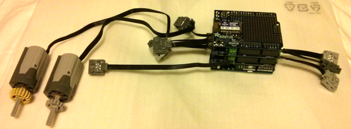

### Arduino ###
Code for Arduino and Android Bluetooth LEGO(R) control.

### Parts ###
* 1x Arduino Uno, I bought part 68 (the starter kit).
* 2x Adafruit MotorShield v2.3, part 1438.
* 1x Adafruit Bluefruit EZ-link Shield, part 1628.
* 5x LEGO(R) power functions extension cords.
* 2x Adafruit stacking header, part 85.

### Assembly Notes ###
1. Power functions cords are cut to make the connectors.
2. Input from the power functions 9V battery pack goes to Vin of the bottom board.
3. Both boards have the Vin jumper installed.
4. The top board has had it's address jumper soldered for address 0x61.
5. The Bluefruit is operating in direct mode.

### Directory Layout ###

BtC - Android control app.

BtMotorControl - Arduino sketch that pairs with BtC.

CAD - OpenSCAD drawings.

images - Pictures of the project.

### Disclaimer ###
LEGO(R) is a trademark of The LEGO Group of companies which does not sponsor, authorize or endorse this repository.
